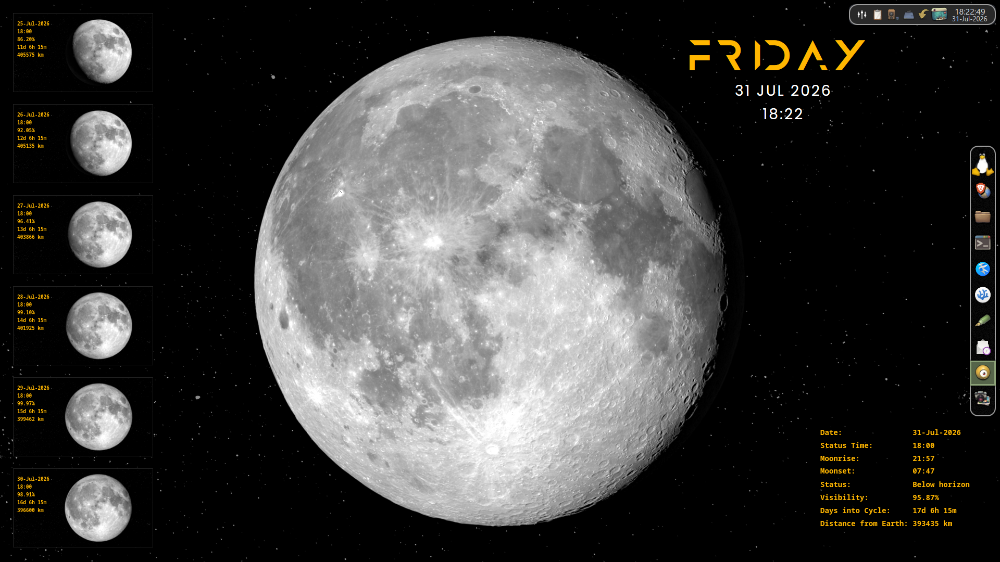
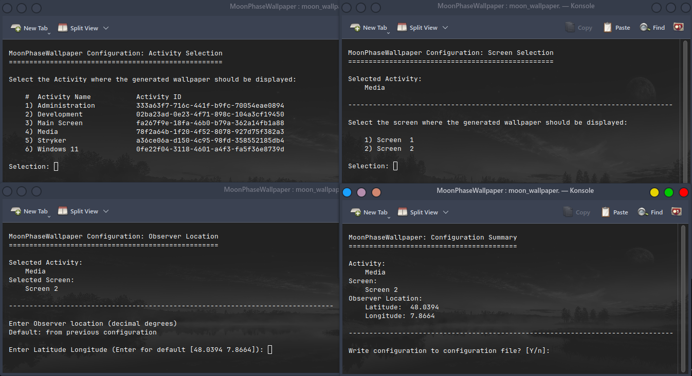
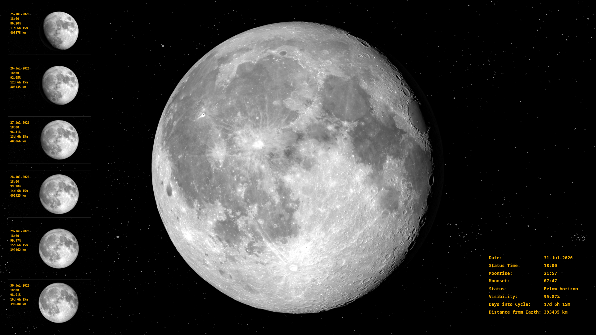

# MoonPhaseWallpaper

Generate beautiful KDE Plasma wallpapers using NASA Moon imagery. 

Unlike static Moon wallpapers, MoonPhaseWallpaper updates the displayed Moon every hour using real NASA imagery and observer-dependent astronomical calculations.

> MoonPhaseWallpaper is designed for KDE Plasma on Linux. It uses NASA Scientific Visualization Studio (SVS) Moon imagery and astronomical calculations to generate observer-dependent wallpapers that update automatically every hour.



## Features

- Generates wallpapers automatically or on demand
- Calculates observer-dependent lunar orientation as seen from the configured observer location
- Displays moonrise, moonset and additional astronomical information
- Uses NASA Scientific Visualization Studio (SVS) moon imagery
- Installs wallpapers automatically in KDE Plasma
- Supports KDE Plasma Activities
- Provides an interactive Configuration Wizard

## Highlights

- Observer-dependent Moon orientation
- Automatic hourly updates
- Interactive Configuration Wizard
- KDE Plasma Activities support
- No background daemon required (systemd timer)

## Requirements

Developed and tested on 

- Fedora 44
- KDE Plasma 6.7
- Wayland

Other Linux distributions running KDE Plasma 6.x may also work but have not been tested.

## Required software
MoonPhaseWallpaper requires the following runtime components:

- Git (to clone the repository)
- Bash
- GNU Awk
- ImageMagick
- curl
- qdbus-qt6
- Internet connection (to download NASA SVS images and datasets). Each wallpaper update downloads approximately 30–35 MiB of image data. The yearly astronomical dataset is downloaded only once per year.

## Installation

See [INSTALL.md](INSTALL.md).

## Configuration

Run the **Configuration Wizard** once after installation to select the target KDE Activity, target screen, and observer location. These settings are stored in a user-specific configuration file and are used for all subsequent wallpaper updates.



## Usage

Generate a wallpaper manually:

```bash
./moon_wallpaper.sh
```

Configure MoonPhaseWallpaper:

```bash
./moon_wallpaper.sh -c
```

To update the wallpaper automatically every hour, configure the included `systemd` user timer.

> The generated wallpaper is written to the project's `images/` directory before being applied to the configured KDE Activity and screen.

## Command-line options

| Option | Mode                 | Description                    |
|--------|----------------------|--------------------------------|
| `-c`   | Configuration Wizard | Start the Configuration Wizard |
| `-d`   | Debug mode           | Show (very) detailed information during execution |
| `-f`   | Force execution      | Force wallpaper generation even if it has already been created for the current hour |
| `-v`   | Verbose mode         | Display progress information during execution |


## Example output



## How it works

Every hour MoonPhaseWallpaper downloads the yearly NASA Scientific Visualization Studio (SVS) Moon dataset if necessary, calculates the apparent lunar orientation for the configured observer location, overlays astronomical information, and automatically updates the KDE Plasma wallpaper on the configured Activity and screen.

## License

This project is licensed under the MIT License. See [LICENSE](LICENSE).

## Acknowledgements

- [NASA Scientific Visualization Studio (SVS)](https://svs.gsfc.nasa.gov/) for providing Moon imagery and datasets
- ImageMagick for image composition
- GNU Awk for enabling astronomical calculations
